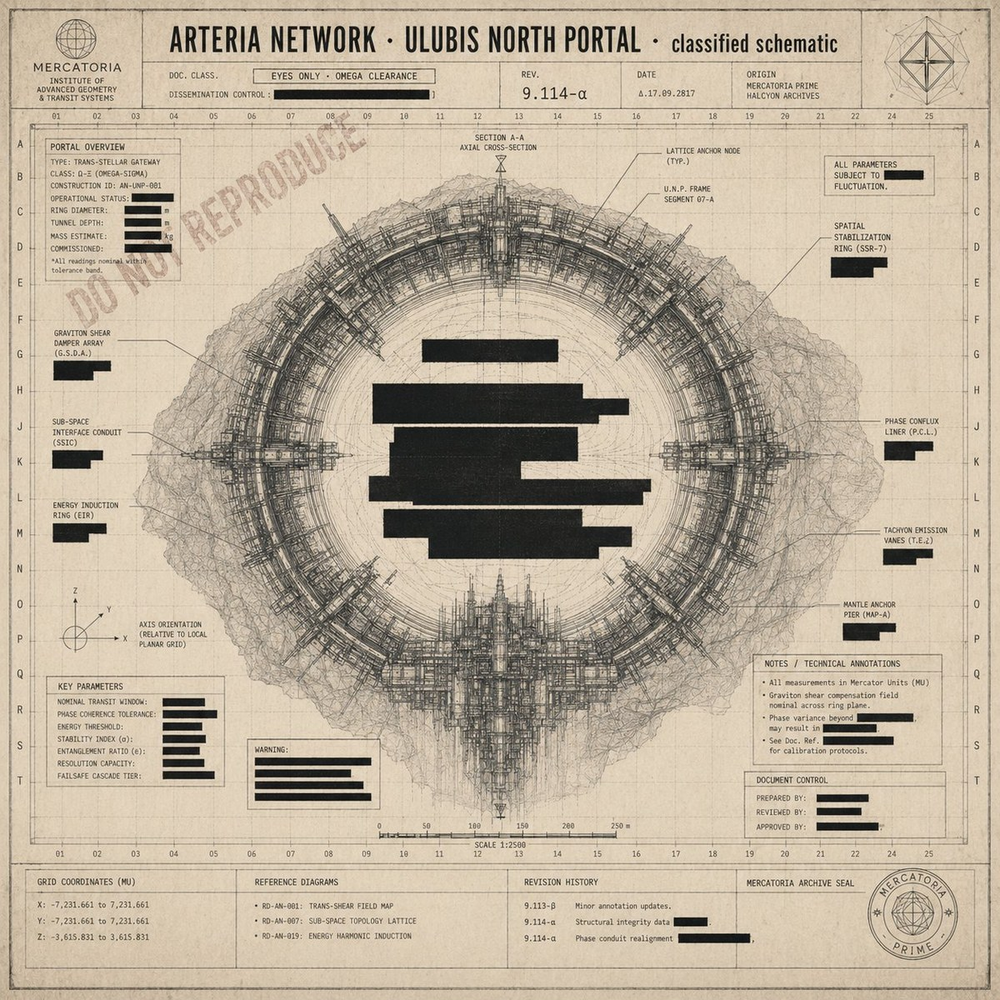

# Mercatoria Incident Archive
*A creative-critical artefact for GENS4015*
Based on Iain M. Banks's *The Algebraist*

## ▸ [Open the archive](https://mshui-code.github.io/GENS4015-final/)

## What this is

You are seated, briefly, at a query terminal in the Ulubis bureau of the Mercatoria. You have been cleared to Tier 2. A small caseload of incident files has been assigned to you for review. You are reminded that the archive is provided for case-handling purposes only, and that all queries are recorded.

Begin at the cover schematic. Click to enter.

## Recommended experience

- **Time** &nbsp;·&nbsp; 8–12 minutes for a full session
- **Device** &nbsp;·&nbsp; Desktop or laptop browser at full window size
- **Browser** &nbsp;·&nbsp; Any current Chrome / Safari / Firefox / Edge

## Files in this repository

| File | Purpose |
|---|---|
| `index.html` | The interactive artefact |
| `cover.jpg` | Cover schematic image |
| `README.md` | This file |

## A note for first-time visitors

The work rewards patience and a second visit. The archive does not show all of itself at once.

---

Author · Shuhui Mei · z5455828 &nbsp;·&nbsp; GENS4015 T1 2026
